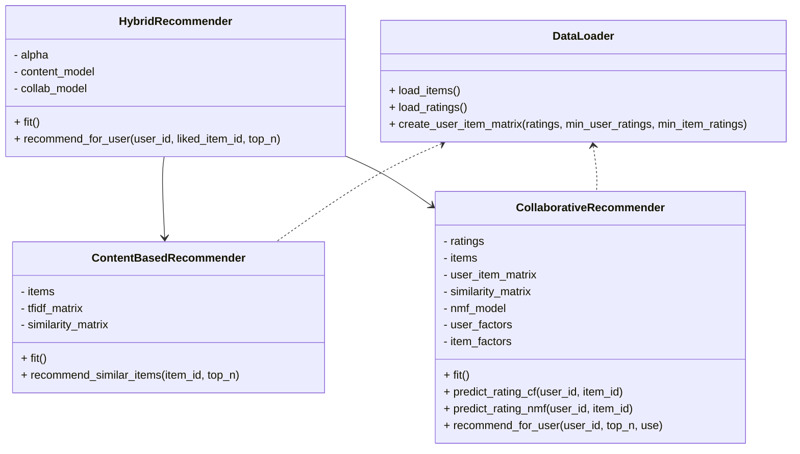

## 1. Project Overview

### Problem Statement

Develop a machine learning-based recommendation engine that provides **personalized content or product suggestions** to users based on:

- Historical interactions (ratings)
- User behavior patterns
- User-item metadata (e.g., titles, descriptions)

### High-Level Features

- Load and preprocess user–item interaction data.
- Build:
  - Collaborative filtering model
  - NMF (matrix factorization) model
  - Content-based model
  - Hybrid model combining multiple signals.
- Evaluate models with:
  - **RMSE**, **MAE**, **Precision@K**
- Simple **web interface** (Flask) to:
  - Input user ID and liked item
  - Get recommended items
- Optional dashboard page to show **model comparison metrics**.

---

## 2. Tech Stack

- **Language:** Python 3.9+  
- **Libraries:**
  - `pandas`, `numpy`
  - `scikit-learn`
  - `Flask`
  - `matplotlib` (for EDA & plots)
- **Tools / Environment:**
  - Jupyter Notebook (for EDA & experiments)
  - GitHub (for version control / portfolio)

---

## 3. Project Structure

```text
Root folder
├── app.py                     # Main Flask application
│
├── data/
│   ├── items.csv              # Item metadata (e.g., movies/products)
│   └── ratings.csv            # User-item ratings
│
├── recommender/
│   ├── __init__.py
│   ├── data_loader.py         # Data loading & preprocessing
│   ├── content_based.py       # TF-IDF + cosine similarity recommender
│   ├── collaborative.py       # CF + NMF collaborative models
│   ├── hybrid.py              # Hybrid recommendation engine
│   └── evaluation.py          # RMSE, MAE, Precision@K
│
├── templates/
│   ├── base.html              # Base layout for Flask pages
│   ├── index.html             # Main recommendation page
│   └── dashboard.html         # Model comparison dashboard (optional)
│
├── static/
│   └── style.css              # CSS styling for web pages
│
├── notebooks/
│   ├── eda.ipynb              # Week 1 - Exploratory Data Analysis
│   └── model_evaluation.ipynb # Week 2/3 - Model evaluation & comparison
│
├── requirements.txt           # Project dependencies
├── README.md                  # This file
└── reports/
    └── final_report.md        # Week 4 - Project report
````

---

## 4. Data Format

You can use any user–item dataset (e.g., MovieLens, Amazon reviews).
For this project, we assume **two main CSV files**:

### 4.1 `data/ratings.csv`

| Column  | Type  | Description                      |
| ------- | ----- | -------------------------------- |
| user_id | int   | Unique ID for each user          |
| item_id | int   | Unique ID for each item          |
| rating  | float | Rating given by user to the item |

**Example:**

```csv
user_id,item_id,rating
1,10,4.0
1,20,5.0
2,10,3.0
3,30,4.5
```

### 4.2 `data/items.csv`

| Column      | Type   | Description                 |
| ----------- | ------ | --------------------------- |
| item_id     | int    | Unique ID for each item     |
| title       | string | Human-readable title        |
| description | string | Text description / metadata |

**Example:**

```csv
item_id,title,description
10,Inception,"Sci-fi heist movie about dreams"
20,Interstellar,"Sci-fi movie about space exploration"
30,The Matrix,"Sci-fi movie about virtual reality"
```

---

## 5. Setup & Installation

### 5.1 Clone the Repository

```bash
git clone https://github.com/your-username/personalized_recommender.git
cd personalized_recommender
```

### 5.2 Create Virtual Environment (Recommended)

```bash
python -m venv venv
# Windows
venv\Scripts\activate
# macOS / Linux
source venv/bin/activate
```

### 5.3 Install Dependencies

Make sure `requirements.txt` contains at least:

```text
Flask
pandas
numpy
scikit-learn
matplotlib
joblib
```

Then install:

```bash
pip install -r requirements.txt
```

---

## 6. Running the Web App

Once dependencies are installed and `data/` is filled with `items.csv` and `ratings.csv`:

```bash
python app.py
```

Open your browser and go to:

```text
http://127.0.0.1:5000/
```

### 6.1 Home Page (`/`)

* Input **User ID**
* (Optional) Select a **liked item** from the dropdown
* Click **“Get Recommendations”**
* See a list of recommended items with scores
* (Optional) Send **feedback** (like/dislike) for a recommended item

### 6.2 Dashboard (`/dashboard`)

* Shows table with metrics for different models:

  * CF
  * NMF
  * Hybrid
* You can hardcode the metrics or load them from a saved file.

---

## 7. Notebooks & Experiments

### 7.1 `notebooks/eda.ipynb` (Week 1)

Contains:

* Loading `ratings.csv` and `items.csv`
* Rating distribution (`ratings["rating"].hist()`)
* Ratings per user / item
* Top 10 most-rated items
* Sparsity of user–item matrix

Use this notebook to understand the dataset and include plots in your **report**.

### 7.2 `notebooks/model_evaluation.ipynb` (Week 2/3)

Contains:

* Train/test split for ratings
* Training collaborative (CF) + NMF models
* Predicting ratings for test set:

  * `pred_cf = predict_rating_cf(...)`
  * `pred_nmf = predict_rating_nmf(...)`
  * `pred_hybrid = alpha * cf + (1 - alpha) * nmf`
* Calculating:

  * `RMSE`
  * `MAE`
  * `Precision@K`
* Building a summary table to compare CF vs NMF vs Hybrid.

You can copy the numbers from this notebook into:

* `/dashboard` page
* `reports/final_report.md`

---

## 8. Code Modules Overview

### 8.1 `recommender/data_loader.py`

* Loads `items.csv` and `ratings.csv`
* Basic cleaning:

  * Remove missing values
  * Filter invalid ratings
* Builds **user–item matrix** for collaborative filtering.

### 8.2 `recommender/collaborative.py`

* Implements **collaborative filtering**:

  * User-based similarity (cosine)
  * Item-based style approach (configurable)
* Implements **NMF matrix factorization**:

  * Decomposes rating matrix into user + item latent factors
* Provides:

  * `predict_rating_cf(user_id, item_id)`
  * `predict_rating_nmf(user_id, item_id)`
  * `recommend_for_user(user_id, top_n, use="nmf" or "cf")`

### 8.3 `recommender/content_based.py`

* Uses TF-IDF on item `title + description`
* Computes cosine similarity between items
* Provides:

  * `recommend_similar_items(item_id, top_n)`

### 8.4 `recommender/hybrid.py`

* Combines:

  * Collaborative scores (NMF-based)
  * Content-based similarity scores
* Normalizes scores and merges them using:
  [
  \text{final_score} = \alpha \cdot \text{collab_score} + (1 - \alpha) \cdot \text{content_score}
  ]
* Provides:

  * `recommend_for_user(user_id, liked_item_id, top_n)`

### 8.5 `recommender/evaluation.py`

* Implements:

  * `rmse(y_true, y_pred)`
  * `mae(y_true, y_pred)`
  * `precision_at_k(recommended_items, relevant_items, k)`

---

## 9. UML / Architecture Diagrams

GitHub supports **Mermaid** diagrams, so you can preview these directly in the README.

### 9.1 High-Level Architecture

```mermaid
flowchart LR
    User[User] -->|HTTP Request| FlaskApp[Flask Web App (app.py)]

    FlaskApp -->|Load Data| DataLoader[data_loader.py]
    FlaskApp --> Hybrid[HybridRecommender]

    Hybrid --> Collab[CollaborativeRecommender]
    Hybrid --> Content[ContentBasedRecommender]

    Collab --> RatingsData[(ratings.csv)]
    Content --> ItemsData[(items.csv)]

    DataLoader --> RatingsData
    DataLoader --> ItemsData

    FlaskApp -->|Recommendations| User
```

### 9.2 Recommender Class Diagram (Simplified)



---

## 10. How to Use in a 4-Week Plan

You can present this project as a **structured 4-week timeline**:

* **Week 1:** Data collection, cleaning, EDA (`data_loader.py`, `eda.ipynb`)
* **Week 2:** CF + NMF implementation and evaluation (`collaborative.py`, `evaluation.py`, `model_evaluation.ipynb`)
* **Mid-Project Review:** Show metrics and plots
* **Week 3:** Content-based + Hybrid models (`content_based.py`, `hybrid.py`), basic feedback loop in `app.py`
* **Week 4:** Flask interface, dashboard, final report (`index.html`, `dashboard.html`, `final_report.md`)

---

## 11. Future Work

* Add more advanced models (e.g., SVD++, LightFM, neural recommenders)
* Use implicit feedback (clicks, views) rather than explicit ratings only
* Deploy with a database (e.g., PostgreSQL) instead of CSV files
* Add authentication and user profiles on the web interface

---

## 12. License

You can choose a license (e.g., MIT) and place it here.

```text
MIT License
Copyright (c) 2025 ...
```

---
